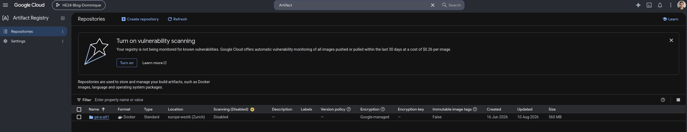
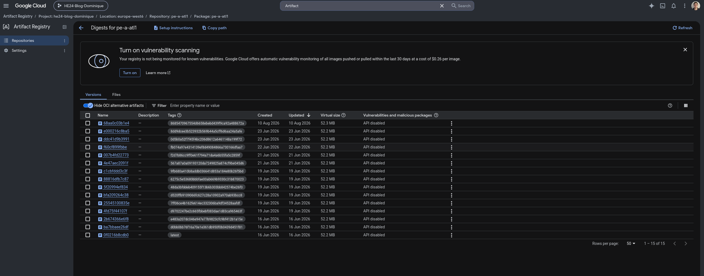
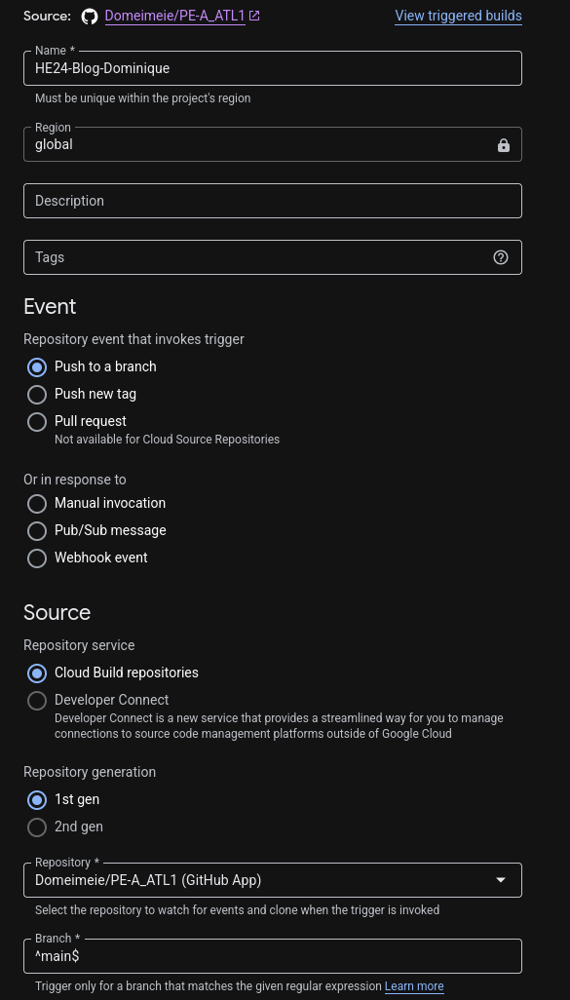
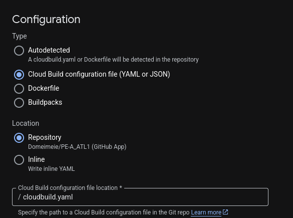
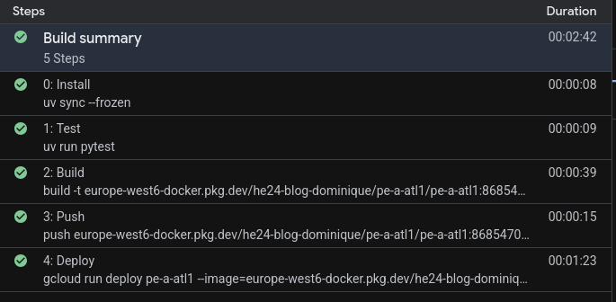
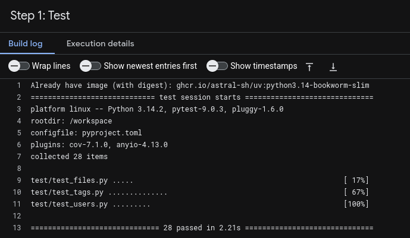
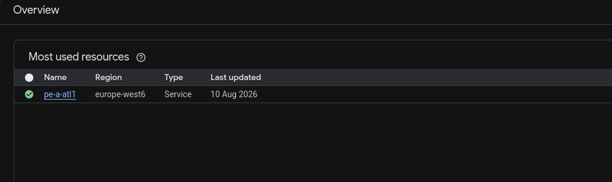
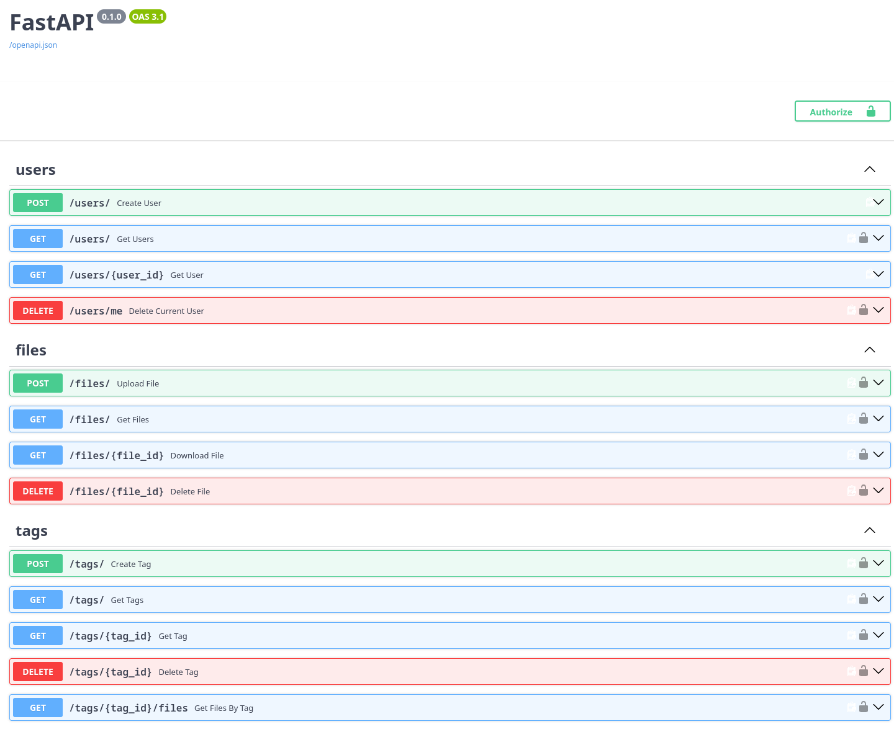
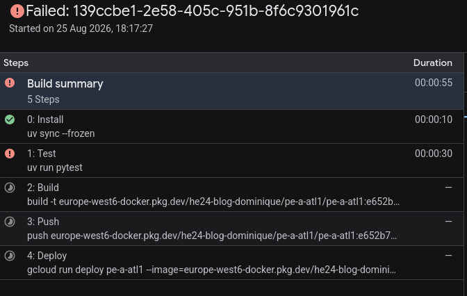
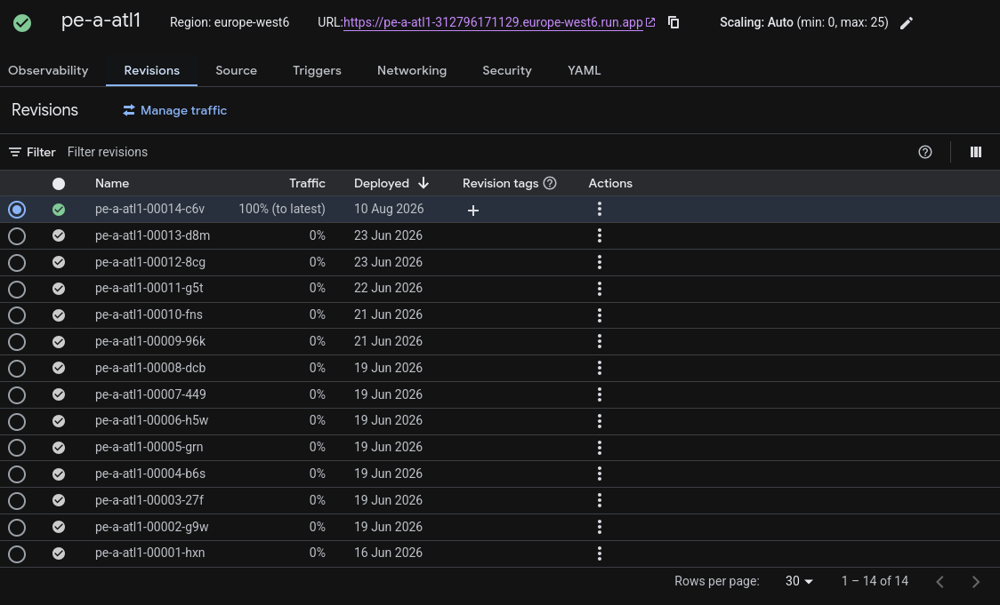

# PE-A_ATL1 – „DODOload" 📦

Eine einfache **File-Management-API**, gebaut mit [FastAPI](https://fastapi.tiangolo.com/).
Benutzer können sich registrieren und anmelden, Dateien hoch- und herunterladen,
diese mit eigenen **Tags** organisieren und ihren Account inklusive aller Daten
wieder löschen. Jeder Benutzer sieht und verwaltet ausschliesslich seine **eigenen**
Dateien und Tags.

Das Projekt wurde im Rahmen des Modules PE-A in der HF-ICT als Anwendungs- und Transferleistung erarbeitet.

---

## ✨ Funktionsumfang

- **Authentifizierung** über JWT (Bearer-Token).
- **Datei-Upload / -Download** mit Speicherung der Bytes auf der Festplatte und
  der Metadaten in der Datenbank.
- **Tags** auf Benutzerbasis – Dateien können beim Upload mit 0 oder mehr Tags
  versehen werden; Dateien lassen sich nach Tag abfragen.
- **Strikte Eigentümer-Prüfung** – fremde Dateien/Tags liefern `404`.
- **Account-Löschung**, die alle Dateien (Festplatte + Datenbank) und Tags des
  Benutzers mitentfernt.

---

## 🧱 Technologie-Überblick

| Bereich        | Verwendet                                  |
| -------------- | ------------------------------------------ |
| Sprache        | Python 3.14                                |
| Framework      | FastAPI                                    |
| Datenbank      | SQLite über SQLModel                       |
| Auth           | JWT (PyJWT)                                 |
| Paketmanager   | [uv](https://github.com/astral-sh/uv)      |
| Tests          | pytest / pytest-cov                        |
| Deployment     | Docker → Google Cloud Build → Cloud Run    |

---

## 🚀 Installation & Start

Das Projekt lässt sich auf drei Arten betreiben: lokal mit **uv**, als **Docker**-Container
oder vollautomatisch über die **Google-Cloud-Pipeline**. Nach einem lokalen Start
(uv oder Docker) ist die API erreichbar unter:

```text
http://127.0.0.1:8000
```

> 💡 **Interaktive Dokumentation:** FastAPI stellt automatisch eine Swagger-UI
> unter `http://127.0.0.1:8000/docs` bereit. Dort lassen sich alle Endpunkte
> direkt ausprobieren.

### 🧰 Lokal mit uv

Voraussetzung: [uv](https://github.com/astral-sh/uv) ist installiert.

```bash
# 1. Abhängigkeiten installieren (aus uv.lock, reproduzierbar)
uv sync

# 2. Entwicklungsserver starten (mit Auto-Reload)
uv run fastapi dev app/main.py
```

### 🐳 Build & Start mit Docker

Das mitgelieferte [Dockerfile](Dockerfile) erstellt ein schlankes Image in zwei
Stufen (Build der Abhängigkeiten → schlankes Laufzeit-Image).

```bash
# Image bauen
docker build -t pe-a-atl1 .

# Container starten (Port 8000 nach aussen mappen)
docker run -p 8000:8000 pe-a-atl1
```

Im Container wird die App mit `fastapi run main.py --host=0.0.0.0` auf Port `8000`
gestartet.

### ☁️ Automatisches Deployment (Google Cloud)

> 🌐 **Live-Instanz:** Die Anwendung läuft unter
> <https://pe-a-atl1-312796171129.europe-west6.run.app> –
> die interaktive Swagger-UI ist entsprechend unter
> [`/docs`](https://pe-a-atl1-312796171129.europe-west6.run.app/docs) erreichbar.

Die Datei [cloudbuild.yaml](cloudbuild.yaml) beschreibt eine **Cloud-Build-Pipeline**,
die bei jedem Push auf `main` die Tests ausführt und die Anwendung anschliessend
auf **Google Cloud Run** (Region `europe-west6`) deployt.

> 📘 **Ausführliche Dokumentation:** Der vollständige Aufbau mit Artifact
> Registry, Trigger, Berechtigungen, Screenshots und dem Verhalten bei
> fehlschlagenden Tests steht im Kapitel „ATL #2: Deployment in die Google
> Cloud" am Ende dieses Dokuments.

---

## 🧪 Tests ausführen

```bash
# Alle Tests
uv run pytest

# Mit Code-Coverage-Bericht
uv run pytest --cov=app --cov-report=term-missing
```

---

## 🗂️ Projektstruktur / Komponenten

```text
app/
├── main.py          # FastAPI-App, bindet alle Router ein
├── database.py      # Datenbank-Engine & Session-Dependency
├── security.py      # JWT-Prüfung (token_auth)
├── models/          # SQLModel-Tabellen (User, File, Tag, FileTagLink)
├── schemas/         # Pydantic-Schemas für Requests/Responses
├── routers/         # HTTP-Endpunkte (users, files, tags, auth)
└── services/        # Geschäftslogik (von den Routern aufgerufen)
test/                # pytest-Tests + gemeinsame Fixtures (conftest.py)
```

**Schichten-Prinzip:** Die **Router** lesen das Token und reichen die `user_id`
an die **Services** weiter. Die Services enthalten die eigentliche Logik und die
Eigentümer-Prüfung und bleiben dadurch frei von HTTP-/JWT-Details.

---

## 📖 API-Dokumentation

Basis-URL lokal: `http://127.0.0.1:8000`

### Authentifizierung

Geschützte Endpunkte erwarten einen Bearer-Token im Header:

```text
Authorization: Bearer <access_token>
```

Das Token erhält man über `POST /auth/login`.

#### Typischer Ablauf

```bash
# 1. Benutzer anlegen
curl -X POST http://127.0.0.1:8000/users \
  -H "Content-Type: application/json" \
  -d '{"email": "homer@ithaca.gr", "password": "odyssey"}'

# 2. Anmelden und Token erhalten
curl -X POST http://127.0.0.1:8000/auth/login \
  -H "Content-Type: application/json" \
  -d '{"email": "homer@ithaca.gr", "password": "odyssey"}'
# -> { "access_token": "eyJhbGciOi..." }

# 3. Datei mit Token hochladen (optional mit Tags)
curl -X POST http://127.0.0.1:8000/files/ \
  -H "Authorization: Bearer <access_token>" \
  -F "upload=@./bild.png" \
  -F "tag_ids=1"
```

### Auth

| Methode | Pfad          | Auth | Beschreibung                                  |
| ------- | ------------- | ---- | --------------------------------------------- |
| `POST`  | `/auth/login` | –    | Anmelden, liefert `{ "access_token": "..." }` |

### Users

| Methode  | Pfad           | Auth | Beschreibung                                            |
| -------- | -------------- | ---- | ------------------------------------------------------- |
| `POST`   | `/users`       | –    | Benutzer registrieren (`{ email, password }`)           |
| `GET`    | `/users`       | ✅   | Liste der Benutzer                                       |
| `GET`    | `/users/{id}`  | –    | Einzelnen Benutzer abrufen                              |
| `DELETE` | `/users/me`    | ✅   | **Eigenen** Account inkl. aller Dateien & Tags löschen   |

### Files

| Methode  | Pfad               | Auth | Beschreibung                                                       |
| -------- | ------------------ | ---- | ----------------------------------------------------------------- |
| `POST`   | `/files/`          | ✅   | Datei hochladen (`multipart/form-data`: `upload`, optional `tag_ids`) |
| `GET`    | `/files/`          | ✅   | Eigene Dateien auflisten (Metadaten als JSON)                     |
| `GET`    | `/files/{id}`      | ✅   | Datei-Bytes herunterladen                                         |
| `DELETE` | `/files/{id}`      | ✅   | Eigene Datei löschen (Festplatte + Datenbank)                    |

> `tag_ids` akzeptiert sowohl wiederholte Felder (`tag_ids=1&tag_ids=2`) als auch
> eine kommagetrennte Liste (`tag_ids=1,2`) – Letzteres insbesondere für die Swagger-UI.

### Tags

| Methode  | Pfad                  | Auth | Beschreibung                               |
| -------- | --------------------- | ---- | ------------------------------------------ |
| `POST`   | `/tags/`              | ✅   | Tag anlegen (`{ "name": "..." }`)          |
| `GET`    | `/tags/`              | ✅   | Eigene Tags auflisten                      |
| `GET`    | `/tags/{id}`          | ✅   | Einzelnen Tag abrufen                      |
| `GET`    | `/tags/{id}/files`    | ✅   | Alle Dateien mit diesem Tag abrufen        |
| `DELETE` | `/tags/{id}`          | ✅   | Tag löschen (wird von allen Dateien entfernt) |

---

## 📦 Abhängigkeiten (Auszug)

- `fastapi[standard]` – Web-Framework inkl. Server (uvicorn) und CLI
- `sqlmodel` – ORM + Pydantic-Modelle für die Datenbank
- `pyjwt` – Erstellen/Prüfen der JWT-Token
- `python-multipart` – nötig, damit FastAPI `multipart/form-data`-Uploads verarbeiten kann
- `pytest` / `pytest-cov` *(dev)* – Tests und Coverage

---

## 💭 Überlegungen

### Identität aus dem Token statt vom Client

Beim Hochladen oder Löschen wird die `user_id` aus dem authentifizierten JWT
gelesen und nicht als Parameter akzeptiert. So kann niemand im Namen anderer
handeln, indem er einfach eine fremde ID mitschickt.

### 404 statt 403 bei fremden Ressourcen

Greift jemand auf eine fremde Datei oder einen fremden Tag zu, wird `404 Not Found`
(statt `403 Forbidden`) zurückgegeben. So wird nicht verraten, dass die Ressource
überhaupt existiert. -> Yay für Security!

### Dateien: Bytes auf Disk, Metadaten in der Datenbank

Die eigentlichen Datei-Bytes liegen im Dateisystem, während Name, Typ, Grösse und
Besitzer in der Datenbank gespeichert werden. Der Dateiname auf der Festplatte wird
mit einer UUID versehen. Das verhindert Namenskollisionen und Path-Traversal.

### Tags als Many-to-many-Verknüpfung

Tags werden über eine eigene Verknüpfungstabelle mit Dateien verbunden, statt sie
z. B. als kommaseparierten String an der Datei zu speichern. Nur so lassen sich
Dateien sauber nach Tag abfragen und ein gelöschter Tag von allen Dateien entfernen.

---

## ⚙️ Potentielle Änderungen/Verbesserungen

### Wechsel auf Cloud SQL

SQLite auf einem GCS-Volume ist nur bedingt für Cloud Run geeignet: Das Locking
funktioniert nicht zuverlässig (Korruptionsrisiko) und die App muss bei
`max-instances=1` bleiben. Ein Wechsel auf **Cloud SQL** (verwaltetes PostgreSQL)
würde dieses Problem lösen und horizontale Skalierung ermöglichen.

### Passwort-Hashing

Passwörter werden aktuell im **Klartext** in der Datenbank gespeichert und
verglichen. Sie sollten stattdessen mit einem etablierten Verfahren (z. B. bcrypt)
**gehasht** werden, damit sie bei einem Datenbank-Leak nicht offen einsehbar sind.

### Ablaufende Tokens

Die JWT-Tokens haben aktuell **kein Ablaufdatum** und bleiben unbegrenzt gültig –
selbst nach dem Löschen des Accounts. Ein Ablaufdatum (z. B. Gültigkeit von
einigen Stunden) würde das Risiko bei einem geleakten Token deutlich verringern.
---

## ☁️ ATL #2: Deployment in die Google Cloud

Bis hierhin lief DODOload nur lokal. Damit die Anwendung von mehreren Benutzern
gleichzeitig genutzt werden kann, wird sie in der **Google Cloud** gehostet: Bei
jedem Push auf `main` startet automatisch eine **Cloud-Build**-Pipeline, die die
Tests ausführt, ein Container-Image baut, dieses in die **Artifact Registry**
pusht und die Anwendung auf **Cloud Run** deployt.

> 🔑 **Kernprinzip:** Der Test-Schritt steht **vor** dem Build. Schlägt auch nur
> ein Test fehl, bricht die Pipeline ab. Es wird weder ein Image gepusht noch
> eine neue Revision ausgerollt. Die bisherige Version bleibt unverändert online.

### Überblick der Pipeline

```text
   git push (Branch main)
            │
            ▼
   ┌────────────────────┐
   │  Cloud Build       │  ausgelöst über GitHub-Trigger
   └────────────────────┘
            │
            ▼
   ① Install ──► uv sync --frozen          Abhängigkeiten aus uv.lock
            │
            ▼
   ② Test ────► uv run pytest              ✗ Fehler ⇒ Pipeline bricht hier ab
            │
            ▼
   ③ Build ───► docker build               Image, Tag = Commit-SHA
            │
            ▼
   ④ Push ────► Artifact Registry          europe-west6-docker.pkg.dev
            │
            ▼
   ⑤ Deploy ──► Cloud Run                  neue Revision, Region europe-west6
            │
            ▼
   https://pe-a-atl1-312796171129.europe-west6.run.app
```

---

### Schritt 1: Projekt und APIs vorbereiten

> ⚠️ **Vor der Abgabe prüfen:** Die Liste der APIs und der `gcloud`-Befehl unten sind der Standardweg. Bitte
> mit deinem tatsächlichen Vorgehen in der Konsole abgleichen.

Im Google-Cloud-Projekt `he24-blog-dominique` wurden die benötigten APIs
aktiviert. Ohne diese schlagen die späteren Schritte mit einem
`SERVICE_DISABLED`-Fehler fehl.

| API                     | Wozu                                        |
| ----------------------- | ------------------------------------------- |
| Cloud Build API         | Ausführen der Pipeline                      |
| Artifact Registry API   | Speichern der Container-Images              |
| Cloud Run Admin API     | Deployen und Betreiben des Dienstes         |
| Cloud Storage API       | Bucket für persistente Daten                |

```bash
gcloud services enable \
  cloudbuild.googleapis.com \
  artifactregistry.googleapis.com \
  run.googleapis.com \
  storage.googleapis.com
```

---

### Schritt 2: Artifact Registry einrichten

Die gebauten Images brauchen einen Ablageort. Dafür wurde ein
**Docker-Repository** in der Artifact Registry angelegt, bewusst in derselben
Region wie der spätere Cloud-Run-Dienst, damit die Images beim Deployen nicht
über Regionsgrenzen gezogen werden müssen.

```bash
gcloud artifacts repositories create pe-a-atl1 \
  --repository-format=docker \
  --location=europe-west6
```

Das Repository ist vom Typ `Standard`, das Format ist `Docker` und der Standort
`europe-west6 (Zurich)`.

Daraus ergibt sich der vollständige Image-Pfad, der in der
[cloudbuild.yaml](cloudbuild.yaml) als Substitution `_IMAGE` hinterlegt ist:

```text
europe-west6-docker.pkg.dev/he24-blog-dominique/pe-a-atl1/pe-a-atl1
```

> 💡 **Artifact Registry statt Container Registry:** Die klassische Container
> Registry (`gcr.io`) ist von Google abgekündigt. Die Artifact Registry ist ihr
> direkter Nachfolger und wird für neue Projekte empfohlen. Deshalb fiel die
> Wahl auf sie.



*Das Repository `pe-a-atl1` im Projekt `he24-blog-dominique`: Format `Docker`,
Typ `Standard`, Standort `europe-west6 (Zurich)`.*



*15 gepushte Images im Repository. Die Builds ab dem 16. Juni 2026 tragen den
jeweiligen Commit-SHA als Tag, das allererste Image noch `latest`.*

---

### Schritt 3: Cloud-Build-Trigger mit GitHub verbinden

Damit die Pipeline automatisch startet, wurde das GitHub-Repository über
**Cloud Build → Trigger** verbunden und ein Push-Trigger erstellt.

| Einstellung          | Wert                                     |
| -------------------- | ---------------------------------------- |
| Name                 | `HE24-Blog-Dominique`                    |
| Region               | `global`                                 |
| Event                | Push to a branch                         |
| Repository-Dienst    | Cloud Build repositories (1st gen)       |
| Repository           | `Domeimeie/PE-A_ATL1` (GitHub App)       |
| Branch               | `^main$`                                 |
| Konfigurationstyp    | Cloud Build configuration file (YAML)    |
| Speicherort          | `/cloudbuild.yaml` im Repository         |

Der Trigger reagiert damit ausschliesslich auf Pushes nach `main`. Pushes auf
andere Branches lösen keinen Build aus.



*Trigger `HE24-Blog-Dominique` in der Region `global`: Event „Push to a branch",
Quelle `Domeimeie/PE-A_ATL1` (GitHub App), Branch-Muster `^main$`.*



*Konfigurationstyp „Cloud Build configuration file (YAML or JSON)" mit dem
Speicherort `/cloudbuild.yaml` im Repository.*

---

### Schritt 4: Berechtigungen des Service-Accounts

> ⚠️ **Vor der Abgabe prüfen:** Diese Rollen sind der übliche Satz für eine solche Pipeline, aber **nicht**
> aus deinem Projekt ausgelesen. Bitte unter IAM verifizieren.

Der Build läuft unter einem Service-Account. Dieser braucht mehr Rechte, als er
standardmässig mitbringt. Ohne sie scheitert der `Deploy`-Schritt mit
`PERMISSION_DENIED`.

| Rolle                       | Wofür benötigt                              |
| --------------------------- | ------------------------------------------- |
| `roles/artifactregistry.writer` | Images in die Registry pushen           |
| `roles/run.admin`           | Cloud-Run-Revisionen deployen               |
| `roles/iam.serviceAccountUser` | Dienst unter dem Runtime-Account starten |
| `roles/logging.logWriter`   | Build-Logs schreiben                        |

---

### Schritt 5: Die Pipeline in der cloudbuild.yaml

Die fünf Schritte laufen in fester Reihenfolge. Der `Test`-Schritt ist bewusst
**vor** `Build` einsortiert. Das ist der Kern der Anforderung, dass defekter
Code gar nicht erst deployt wird.

| Schritt   | Image                          | Beschreibung                                  |
| --------- | ------------------------------ | --------------------------------------------- |
| `Install` | `astral-sh/uv`                 | `uv sync --frozen`, reproduzierbar aus `uv.lock` |
| `Test`    | `astral-sh/uv`                 | `uv run pytest`, **Abbruchpunkt bei Fehlern** |
| `Build`   | `cloud-builders/docker`        | Image bauen, Tag = `$COMMIT_SHA`              |
| `Push`    | `cloud-builders/docker`        | Image in die Artifact Registry pushen         |
| `Deploy`  | `cloud-sdk`                    | Neue Revision auf Cloud Run ausrollen         |

Die Substitutionen halten Projekt- und Bucket-Namen an einer Stelle:

```yaml
substitutions:
  _IMAGE: europe-west6-docker.pkg.dev/he24-blog-dominique/pe-a-atl1/pe-a-atl1
  _DATA_BUCKET: pe-a-atl1-data
```



*Erfolgreicher Build mit allen fünf Schritten in Grün, Gesamtdauer 2:42 Min.
(Install 8 s, Test 9 s, Build 39 s, Push 15 s, Deploy 1:23).*



*Log des `Test`-Schritts: 28 Tests gesammelt und in 2.21 s bestanden,
ausgeführt im Image `ghcr.io/astral-sh/uv:python3.14-bookworm-slim`.*

---

### Schritt 6: Cloud Run

Der `Deploy`-Schritt rollt die neue Revision aus. Die wichtigsten Parameter:

| Parameter               | Wert            | Begründung                                    |
| ----------------------- | --------------- | --------------------------------------------- |
| `--region`              | `europe-west6`  | Zürich, gleiche Region wie die Registry       |
| `--port`                | `8000`          | Port, auf dem der Container lauscht            |
| `--min-instances`       | `0`             | Keine Kosten im Leerlauf (dafür Kaltstart)     |
| `--max-instances`       | `1`             | Nötig wegen des SQLite-Locking (siehe unten)   |

> ⚠️ **Vor der Abgabe prüfen:** Die `cloudbuild.yaml` setzt `--max-instances=1`,
> Screenshot 11 zeigt für den laufenden Dienst aber `Scaling: Auto (min: 0,
> max: 25)`. Bitte klären, welcher Wert gilt, und Tabelle bzw. Abschnitt
> „Beschränkung auf eine Instanz" entsprechend anpassen.
| `--allow-unauthenticated` | (Flag)        | Öffentlich erreichbare API                     |



*Cloud-Run-Übersicht mit dem Dienst `pe-a-atl1` in der Region `europe-west6`,
zuletzt aktualisiert am 10. August 2026.*

> 📸 **Screenshot 7 · Cloud Run: Revisionen**
> Zu sehen: die Revisionsliste, in der erkennbar ist, dass bei jedem
> erfolgreichen Build eine neue Revision 100 % des Traffics übernimmt.
> Ablegen unter `docs/screenshots/07-cloudrun-revisionen.png`.




*Die Swagger-UI der laufenden Anwendung mit den Gruppen `users`, `files`
und `tags`.*

---

### 🔴 Verhalten bei fehlschlagenden Tests

Um zu belegen, dass die Pipeline defekten Code wirklich blockiert, wurde ein
Test **absichtlich** so verändert, dass er fehlschlägt, im Beispiel eine
Assertion auf einen falschen Statuscode:

```python
# test/test_users.py: absichtlich falscher Erwartungswert (Commit 66462c1)
def test_duplicate_user(client, user_homer):
    response = client.post("/users", json={"email": "dodododododod@dododod.local",
                                           "password": "gagagagaga"})
    assert response.status_code == 40    # korrekt wäre 409
```

Nach dem Push auf `main` verhält sich Cloud Build wie erwartet:

| Schritt   | Ergebnis                                                       |
| --------- | -------------------------------------------------------------- |
| `Install` | ✅ erfolgreich                                                  |
| `Test`    | ❌ **fehlgeschlagen**, `pytest` beendet sich mit Exit-Code `1` |
| `Build`   | ⏭️ nicht ausgeführt                                             |
| `Push`    | ⏭️ nicht ausgeführt                                             |
| `Deploy`  | ⏭️ nicht ausgeführt                                             |

Der Build wird als **FAILURE** markiert. Entscheidend: In der Artifact Registry
erscheint **kein neues Image** und auf Cloud Run entsteht **keine neue
Revision**. Die zuvor deployte Version bleibt unverändert online und erreichbar.
Anschliessend wurde die Änderung mit dem Folge-Commit `revert` rückgängig
gemacht und der nächste Push lief wieder vollständig durch.



*Fehlgeschlagener Build vom 25. August 2026: `Install` grün, `Test` nach 30 s
rot, die Schritte `Build`, `Push` und `Deploy` wurden gar nicht erst gestartet.*

> 📸 **Screenshot 10 · Cloud Build: Log mit der fehlgeschlagenen Assertion**
> Zu sehen: der Log-Ausschnitt mit der pytest-Ausgabe (`1 failed`, `AssertionError`)
> und der abschliessenden Meldung, dass der Build abgebrochen wurde.
> Ablegen unter `docs/screenshots/10-cloudbuild-fehler-log.png`.




*Revisionsliste des Dienstes: Die aktive Revision `pe-a-atl1-00014-c6v` vom
10. August 2026 hält weiterhin 100 % des Traffics, obwohl am 25. August ein
Build ausgelöst wurde.*

---

### 🧗 Herausforderungen

#### Cloud Run hat ein flüchtiges Dateisystem

Lokal funktionierte alles, in der Cloud waren hochgeladene Dateien und die
Datenbank nach jedem Neustart verschwunden. Der Grund: Das Dateisystem eines
Cloud-Run-Containers ist flüchtig. Gelöst wurde das mit einem
**Cloud-Storage-Bucket**, der als Volume unter `/app/data` eingebunden wird,
ohne eine Zeile Anwendungscode zu ändern, weil die Pfade bereits über
Umgebungsvariablen konfigurierbar waren.

```yaml
- --add-volume=name=data,type=cloud-storage,bucket=${_DATA_BUCKET}
- --add-volume-mount=volume=data,mount-path=/app/data
```

Die Pfade selbst sind über Umgebungsvariablen konfigurierbar. Lokal greifen die
Standardwerte, in der Cloud zeigen sie auf das gemountete Volume:

| Variable        | Zweck                               | Lokaler Standard |
| --------------- | ----------------------------------- | ---------------- |
| `UPLOAD_DIR`    | Ablageort der hochgeladenen Dateien | `uploads`        |
| `DATABASE_FILE` | Pfad der SQLite-Datenbankdatei      | `database.db`    |

#### Beschränkung auf eine Instanz

SQLite auf einem Bucket-Volume verträgt keine parallelen Schreibzugriffe. Damit
sich nicht mehrere Instanzen gegenseitig blockieren, läuft der Dienst mit
`--max-instances=1`. Das ist eine bewusste Übergangslösung. Der saubere Weg
wäre **Cloud SQL**, siehe Abschnitt „Potentielle Änderungen/Verbesserungen".

#### Kaltstart bei `min-instances=0`

Weil im Leerlauf keine Instanz läuft, dauert der erste Aufruf nach einer Pause
einige Sekunden. Das ist für dieses Projekt ein bewusster Kompromiss zugunsten
der Kosten. Für eine Demo lohnt es sich, die Instanz vorher einmal aufzuwärmen.